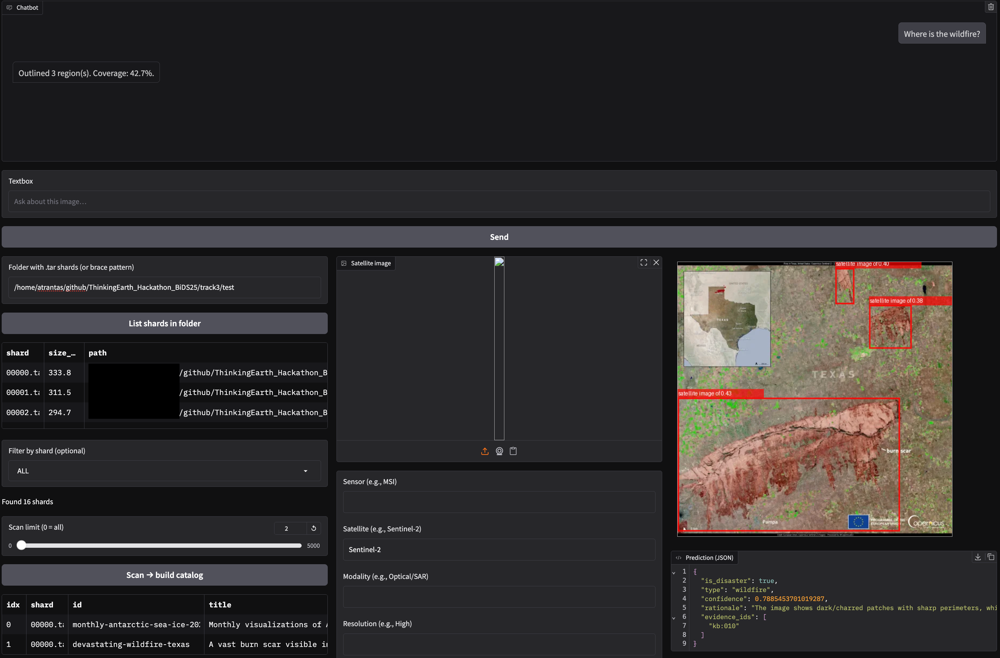

# Disaster-GeoRAG (DGRAG)

This is a self-contained repository for the submission on [Thinking Earth Hackathon - BiDS 2025](https://allhackathons.com/hackathon/harnessing-copernicus-foundation-models-to-decode-earth-from-space/). 

# Solution

A retrieval-augmented VLM pipeline for Earth Observation disaster triage. We stream samples directly from WebDataset .tar shards, run a grounded visual analysis with Qwen2-VL-7B-Instruct, and produce a compact JSON verdict: is_disaster, type, confidence, rationale, evidence_ids. A Gradio app lets you browse shards, preview images, run triage, and compute quick weak-label metrics (binary F1 and type macro-F1) using GAIA dataset tags. Also we use OWLv2 to do grounded image segmentation and localize the catastrophies. All this are done via a chat interface where the user can interact and ask questions and get information from the image(s).

# Features

- Shard browser -> catalog -> pick sample from .tar files; stream without unpacking. 

- Grounded triage: Qwen2-VL prompts + retrieval cues (GeoRAG) -> JSON output. 

- Explainability through rational and disaster cue mapping

- Confidence calibration: blends model score with retrieval support and GAIA tag priors (simple, post-hoc). 

- In-app evaluation on the selected samples only (weak labels from GAIA tags).

- Disaster localization with *talk-to-the-image* capabilities.


## Dataset

In this work we used the [GAIA test split](https://huggingface.co/datasets/azavras/GAIA/viewer/default/test?views%5B%5D=test) to create a PoC.


## Output schema

```json
{
  "is_disaster": true|false|"uncertain",
  "type": "wildfire|flood|storm_wind|earthquake|landslide|volcano|drought|industrial|null",
  "confidence": 0.0-1.0,
  "rationale": "short explanation",
  "evidence_ids": ["kb:..."]
}

```

## Quickstart

Tested on Python 3.12.3

```
# If you are in a cluster: 
module load 2024 Python/3.12.3-GCCcore-13.3.0 CUDA/12.6.0 cuDNN/9.5.0.50-CUDA-12.6.0 NCCL/2.22.3-GCCcore-13.3.0-CUDA-12.6.0

python -m venv venv
source venv/bin/activate
pip install -U pip setuptool wheel
pip install -r requirements.txt
### VLM related
pip install -U transformers
pip install qwen-vl-utils

# (experimental - not for production)
# For use with llava 
pip3 install torch torchvision
pip install transformers==4.35
pip install accelerate==0.31.0
pip install -U accelerate

# For use of GroundDINO & SAM
export CUDA_HOME="$(dirname "$(dirname "$(readlink -f "$(command -v nvcc)")")")"
export PATH="$CUDA_HOME/bin:$PATH"
export LD_LIBRARY_PATH="$CUDA_HOME/lib64:${LD_LIBRARY_PATH:-}"

bash scripts/install_extra.sh
```

## Running steps: 

On the activated virtual environment:

1) Run `bash scripts/build_kb.sh`

2) Then just `bash run_app.sh`

**IMPORTANT:** The workflow requires at least 20GB of VRAM!

## App design overview



## Limitations: 

- Evaluation uses weak labels derived from GAIA tags/text; it’s indicative, not a benchmark score. 

- Deterministic decoding favors stability over generative diversity.

- Processing is per/image for demo purposes

## Contributors

Athansios Trantas & Udit Asopa

## Resources

Some extra [resources](https://github.com/Orion-AI-Lab/ThinkingEarth_Hackathon_BiDS25).

## TODOs

[ ] Benchmark 2 more VLMs
[ ] Stronger evaluation
[ ] Batched results
[ ] Include more datasets
[ ] Add more catastrophies cues
[ ] Write a paper